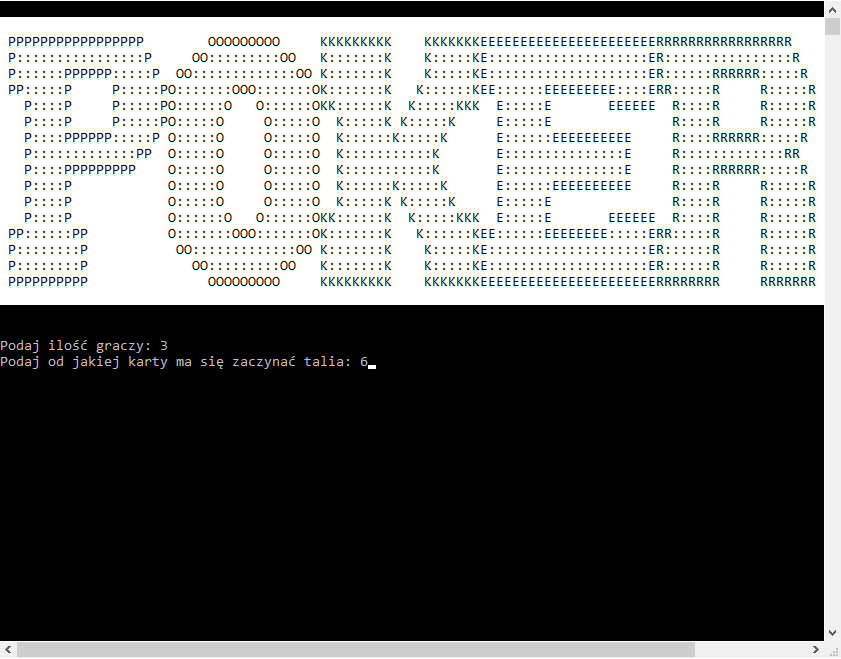
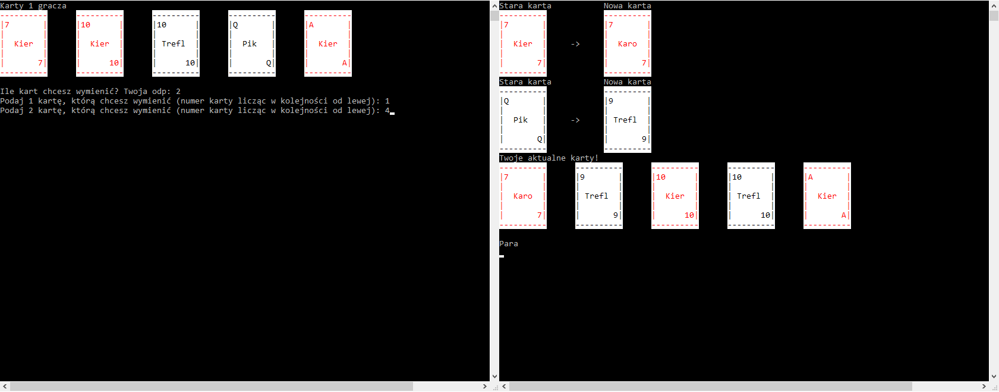
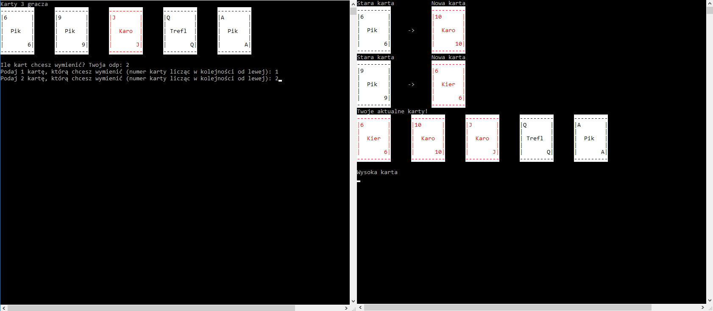

# Poker
"Poker pięciokartowy dobierany" (Program działający w cmd).

## Zakresy danych
**Ilość graczy** od 2 do 5  
**Zakres tali** zależny od ilości graczy (każdy gracz wykorzystuje max 10 kart z całej tali)
> Z tego założenia wynika, że:  
> + dla 2 graczy-użytkownik może wybrać początek tali z zakresu <2, 8>  
> + dla 3 graczy-użytkownik może wybrać początek tali z zakresu <2, 7>  
> + dla 4 graczy-użytkownik może wybrać początek tali z zakresu <2, 5>  
> + dla 5 graczy-użytkownik może wybrać początek tali z zakresu <2>  

**Ilość kart przy wymianie** od 0 do 5  

## Funkcje
* zawiera podstawowe zasady pokera pięciokartowego dobieranego
* wyświetla ręcznie zrobione karty z odpowiednimi kolorami
* sprawdza poprawność wprowadzonych danych (ilość graczy oraz od jakiej karty ma się zaczynać), a następnie dostosowuje swoje działanie do podanych wartości 
* w przypadku gdy parę osób ma taki sam układ kart, potrafi stwierdzić, który z nich jest wyższy oraz uporządkować w kolejności od najmocniejszego układu
* sortuje i wyświetla karty jakie mamy w ręce oraz wyświetla nazwę układu, który powstał z naszych kart
* po wybraniu wszystkich kart do wymiany, program wyświetla każdą z nich osobno przyrównując ją do nowo dobranej, a następnie pod tym, wyświetla posortowane karty w ręce wraz z nazwą nowego układu jaki tworzą
* karty są losowane tylko z dostępnej puli (te, które nie zostały jeszcze do danej pory wykorzystane)
* dostosowuje możliwości wybrania zakresu na podstawie ilości graczy (program zakłada, że każdy gracz wykorzystuje max 10 kart z całej tali (5 w ręce + 5 do wymiany))
* po dokonaniu zmian przez każdego gracza program wyświetla karty w kolejności od najsilniejszego układu razem z nazwą naszej ręki oraz tworzy tabelę wyników

